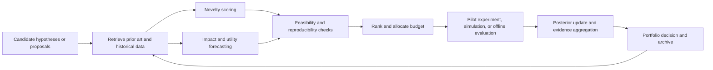

# Quantitative Evaluation of Novelty and Impact of Scientific Hypotheses and Proposals

## Executive summary

Quantitative evaluation of scientific hypotheses and proposals works best when **novelty and impact are treated as separable but interacting constructs**. Novelty can mean unusual recombination of prior knowledge, semantic distance from existing literature, first-time appearance of concepts or relations, or Bayesian surprise relative to a prior belief state. Impact can mean scholarly attention, disruptive influence on later work, technological translation, policy or clinical uptake, reproducibility, or decision-theoretic utility. A large share of the literature warns that single metrics blur these distinctions: citation counts often mix originality with visibility, field size, and review bias; peer review scores often mix novelty with feasibility and taste; and automated novelty metrics can quietly collapse into proxies for topic popularity or writing style.

The most mature ex post novelty proxies are still **bibliometric and semantic**: atypical reference combinations, first-time knowledge combinations, semantic distance among cited works, embedding-space outlier measures, topic-age or “ahead-of-its-time” scores, and disruption-style citation-network measures. The most principled ex ante metrics come from **Bayesian statistics and decision theory**: Bayes factors, model evidence, likelihood ratios, expected information gain, posterior predictive performance, and value-of-information criteria. For practical selection among multiple candidate hypotheses, the strongest systems increasingly use **hybrid pipelines** that combine literature retrieval, semantic ranking, novelty scoring, feasibility checks, and small-budget empirical validation.

Recent AI-for-science work has materially changed the landscape. **DiscoveryBench** formalizes multi-step data-driven discovery and shows current systems are still weak on end-to-end autonomous discovery; **HypoBench** isolates hypothesis generation and finds that combining literature with data outperforms prompting-only approaches; **NovBench** shows current LLMs are still limited at assessing paper novelty; **Idea Novelty Checker** improves agreement by grounding novelty judgments in retrieved literature; **AutoDiscovery** shows Bayesian surprise can guide open-ended exploration better than vague “interestingness”; and **AI Can Learn Scientific Taste** frames proposal ranking as pairwise preference learning from community feedback.

For AI/ML and especially for **recursive self-improvement**, the central lesson is that evaluation should be **closed-loop, portfolio-based, and Goodhart-resistant**. An AI system should not merely score ideas for novelty; it should estimate uncertainty, expected downstream value, reproducibility risk, and opportunity cost, then allocate experimental budget adaptively using causal, counterfactual, and bandit-style methods. It also needs adversarial robustness against gaming, self-citation loops, mode collapse toward fashionable areas, and self-reinforcing reward models trained on community biases.

## Conceptual foundations

A useful starting point is to treat **novelty** as a statement about distance from the prior state of knowledge, and **impact** as a statement about consequences after the idea enters a scientific or technological ecosystem. Scientometrics reviews increasingly separate novelty from neighboring concepts such as originality, innovation, creativity, and breakthrough; they also distinguish scholarly value from scientific soundness, societal value, and technological usefulness. Aksnes and coauthors argue that research quality is multidimensional, with originality only one component among plausibility, scientific value, and societal value. Zhao and Zhang’s recent review similarly emphasizes that novelty metrics vary by what they operationalize: elements, combinations, topics, entities, methods, or discourse-level contributions.

Across the literature, the most useful dimensions are these. **Combinatorial novelty** asks whether a proposal connects pieces of prior knowledge that are rarely or never combined. **Semantic novelty** asks whether the content itself sits far from existing work in a learned representation space. **Method novelty** asks whether the paper introduces a new technique, objective, architecture, or instrument. **Contextual novelty** asks whether known methods are transported into distant domains or datasets. **Explanatory novelty** asks whether the hypothesis changes what can be predicted or explained. **Bayesian surprise** asks whether new evidence shifts posterior belief substantially relative to the prior. These are not interchangeable: Leahey, Lee, and Funk show that different *types* of novelty produce different *types* of downstream influence, with new methods especially associated with disruptive influence. Shi and Evans likewise show that surprising combinations of research contents and contexts are linked to impact and often arise from outsiders bringing distant disciplinary contexts into a problem.

Impact is equally plural. **Scholarly impact** is typically measured through citations, field-normalized citations, or future citation prediction. **Network impact** includes disruption or consolidation of later citation flows. **Technological impact** can be traced via patent citations and industry uptake. **Societal impact** can include policy, guideline, software, benchmark, clinical, or public uptake. **Reliability impact** concerns whether the claim replicates and remains useful under re-analysis, re-implementation, or distribution shift. Veugelers and Wang show that scientific novelty and technological usefulness are related but not identical, while Wang’s “cautionary tale” study shows that the novelty–impact relationship is complex enough that short windows can systematically under-reward unusual work.

This matters because **evaluation timing changes the problem**. Ex ante evaluation of proposals and hypotheses must lean on priors, structure, and decision theory; ex post evaluation of papers leans on citations, reuse, and observed outcomes. Grant-review studies show that panels often try to evaluate both innovation and risk, but reviewer agreement is low, and evidence for systematic anti-novelty conservatism is mixed rather than uniform. Some studies find that evaluation formats can induce conservative choices, while others find no blanket bias against novelty once one measures novelty carefully. The safest conclusion is that novelty is easy to *talk about* and hard to *score reliably*, especially near the funding or acceptance margin.

## Formal metrics

The table below summarizes the main quantitative families. The ratings for computational cost, interpretability, and RSI suitability are synthetic judgments based on the cited literature rather than verbatim source claims.

| Method family | Novelty type | Impact type | Data required | Computational cost | Interpretability | Suitability for AI/ML/RSI |
|---|---|---|---|---|---|---|
| Raw citations, field-normalized citations, early-citation models | None directly; weak proxy | Scholarly attention | Citation graph, field/year metadata | Low | High | Medium |
| Atypical combinations and first-time combinations | Combinatorial | Long-run scholarly or technological impact | References, venue/journal graph, historical baseline | Medium | Medium | High |
| Semantic-distance and embedding novelty | Semantic, conceptual, element-level | Often used as ex ante novelty proxy; sometimes predicts impact | Titles, abstracts, full text, embeddings | Medium to High | Medium | High |
| Topic-age and temporal outlier metrics | Temporal/topic novelty | Often predicts later attention | Corpus over time, topic model or learned age predictor | Medium | Medium | Medium |
| Disruption and surprising content-context combinations | Network and contextual novelty | Disruptive influence or breakthrough-style impact | Citation graph; sometimes text + context metadata | Medium | Medium | High |
| Surprisal and Bayesian surprise | Prior-relative novelty | Information value; exploration reward | Prior/posterior beliefs or generative model | Medium to High | High if model is explicit | Very High |
| Bayes factors, model evidence, likelihood ratios | Explanatory novelty and evidential support | Hypothesis support under uncertainty | Likelihood model, priors, observations | Medium to High | High | Very High |
| Expected information gain and value-of-information | Decision-theoretic novelty and experiment value | Utility of running an experiment | Prior, design space, likelihood | High | High | Very High |
| Reproducibility and replication forecasting | Reliability rather than novelty | Trustworthy impact | Replications, reruns, forecasts, markets | Medium | High | High |
| Downstream utility metrics | Application novelty and usefulness | Technology, policy, code, benchmark, clinical uptake | Patents, policy docs, GitHub, benchmarks, follow-on data | Medium | Medium | Very High |
| Pairwise preference and scientific taste models | Relative novelty/impact judgment | Ex ante ranking of candidates | Preference pairs, community outcomes | High | Medium | Very High |

### Citation and bibliometric proxies

**Description.** The simplest impact scores count citations or normalize them within field, year, and document type. A standard formulation is a field-normalized citation ratio  
\[
FNCI_i = \frac{c_i}{\mathbb{E}[c \mid \text{field},\text{year},\text{type}]},
\]
where \(c_i\) is citations to item \(i\) within a fixed window. Predictive variants estimate future citations from content, author, venue, and early-citation features. **Inputs → outputs.** Inputs are citation metadata, time windows, and normalization strata; output is an attention score or forecast. **Assumptions.** Citations are informative about influence and are comparable after normalization. **Strengths.** Cheap, transparent, available at scale. **Weaknesses.** They are not direct novelty measures and can be distorted by field size, review articles, prestige bias, self-citation, and Matthew effects. **Use cases.** Ex post benchmarking and coarse portfolio triage, not sole ex ante proposal ranking.

### Combinatorial novelty

**Description.** Uzzi-style metrics ask whether a paper uses unusual pairs of references relative to historical expectations; Wang-style “new combination” metrics ask whether the paper creates first-time journal or knowledge combinations, often weighted by semantic or graph distance. A representative Uzzi statistic computes a z-score for each referenced pair \((a,b)\),
\[
z_{ab}=\frac{\mathrm{obs}_{ab}-\mathbb{E}[\mathrm{obs}_{ab}]}{\mathrm{sd}(\mathrm{obs}_{ab})},
\]
and defines paper-level novelty from the lower tail, such as the 10th percentile of pairwise \(z\)-scores. First-time-combination metrics often sum distances over newly formed pairs,
\[
N(H)=\sum_{(a,b)\in \text{new pairs}(H)} d(a,b).
\]
**Inputs → outputs.** Historical reference graph, journal or concept identities, optional semantic distances; output is a paper-level novelty score. **Assumptions.** New science is partly recombinant; rarity relative to a reference distribution captures newness. **Strengths.** Grounded in large-scale scholarly traces; often predictive of later impact when combined with conventional grounding. **Weaknesses.** Sensitive to reference parsing, journal granularity, sparse fields, and the choice of null model; can miss novelty expressed inside text rather than references. **Use cases.** Large-scale screening of papers, fields, or proposal bibliographies; science-of-science studies; ex ante checks for “mere incrementalism.”

### Semantic and temporal novelty

**Description.** Text-based methods embed titles, abstracts, full texts, claims, or cited references into vector spaces, then score novelty by semantic distance, local outlierness, or temporal mismatch. Representative formulations include \(k\)-nearest-neighbor distance,
\[
N_{\text{knn}}(x)=\frac{1}{k}\sum_{j\in \mathcal{N}_k(x)} d(e_x,e_j),
\]
local outlier factor \(LOF(x)\), or temporal residual \(\hat{y}(x)-y\) where \(\hat{y}(x)\) is the predicted publication year from content. **Inputs → outputs.** Text corpus, embeddings or topic model, historical nearest-neighbor index; output is a novelty score and sometimes a nearest-prior-art explanation. **Assumptions.** Semantic space is meaningfully aligned with scientific content; distance from past work corresponds to novelty. **Strengths.** Captures implied knowledge beyond the reference list; can work ex ante on ideas, abstracts, or sections. **Weaknesses.** Embeddings can encode style, hype, and domain bias; distance alone cannot distinguish nonsense from breakthrough; section choice matters. **Use cases.** Novelty checking for idea proposals, peer-review assistance, retrieval-augmented scouts for AI research ideation. Recent work shows gains from full literature grounding and from focusing on specific sections rather than the whole paper.

### Disruption, surprise, and contextual breakthrough metrics

**Description.** Disruption-style metrics ask whether later work cites the focal paper *instead of* its references, rather than alongside them. A standard disruption index is
\[
DI = \frac{N_i-N_j}{N_i+N_j+N_k},
\]
where \(N_i\) later cites the focal paper but not its references, \(N_j\) cites both, and \(N_k\) cites the references but not the focal paper. Shi and Evans extend this general idea by modeling whether content-context combinations are more surprising than expected. Bayesian surprise takes a cleaner decision-theoretic form:
\[
BS = D_{KL}(p(\theta\mid x)\,\|\,p(\theta)).
\]
AutoDiscovery operationalizes surprise as a KL shift in belief about a hypothesis after verification, and then turns “surprisal” into a search reward for open-ended scientific discovery. **Inputs → outputs.** Citation network or prior/posterior belief model; output is a disruption or surprise score. **Assumptions.** Substitution in downstream citation or large posterior shift reflects conceptual novelty. **Strengths.** Better aligned with paradigm-shifting or belief-changing contributions than raw counts. **Weaknesses.** Disruption indices are sensitive to citation inflation and window choice; Bayesian surprise requires an explicit or elicited belief model. **Use cases.** Finding potentially field-reorienting work; guiding autonomous scientific exploration; prioritizing experiments that most change belief.

### Bayesian evidence, information gain, and predictive value

**Description.** These metrics evaluate a hypothesis not by how different it looks, but by how much better it explains or predicts the world. The core objects are model evidence and information gain:
\[
p(D\mid H)=\int p(D\mid \theta,H)\,p(\theta\mid H)\,d\theta,
\]
\[
BF_{12}=\frac{p(D\mid H_1)}{p(D\mid H_2)},
\]
\[
EIG(d)=\mathbb{E}_{y\sim p(y\mid d)}\left[D_{KL}(p(\theta\mid y,d)\,\|\,p(\theta))\right].
\]
Predictive metrics then score out-of-sample performance using log score, RMSE, AUROC, calibration, or posterior predictive checks. **Inputs → outputs.** Formal model, priors, design space, and data; output is evidential support or expected value of running an experiment. **Assumptions.** The probabilistic model is meaningful enough for posterior and predictive comparisons. **Strengths.** Directly connected to experimentation and decision-making; ideal for comparing multiple hypotheses under a budget. **Weaknesses.** More computationally expensive; brittle when the model class is misspecified or priors are poor. **Use cases.** Choosing among mechanistic AI hypotheses, active experiment design, ablations, self-modification evaluation in RSI loops.

### Reproducibility, downstream utility, and community preference

**Description.** Reliability and usefulness are often better long-run impact measures than attention alone. Reproducibility can be operationalized as a replication probability, stability under reruns or re-implementations, or a forecasted probability of successful replication. Downstream utility can be measured by patent citations, software reuse, benchmark adoption, policy citations, clinical translation, or follow-on funding. A pragmatic ex ante ranking score is a weighted utility:
\[
U(H)=\sum_k w_k\,z_k(H),
\]
where \(z_k(H)\) are normalized dimensions such as novelty, predictive gain, feasibility, reproducibility risk, and downstream utility forecast. Preference-learning systems replace hand-set weights with community-derived pairwise comparisons, learning a latent score \(s(H)\) such that
\[
P(H_i \succ H_j)=\sigma\!\left(s(H_i)-s(H_j)\right).
\]
**Inputs → outputs.** Replication data, market prices, downstream activity traces, or preference pairs; output is a reliability or utility score. **Assumptions.** Later reuse or informed forecasts capture practical value better than attention alone. **Strengths.** Better aligned with high-stakes selection. **Weaknesses.** Slow feedback loops, heavy data dependence, and risk of inheriting community biases. **Use cases.** Ranking ambitious proposals, validating AI-generated research ideas, steering portfolios toward robust and useful discoveries rather than mere novelty theater.

## Algorithmic methods

### Literature-grounded embedding pipelines

**Brief description.** These systems retrieve candidate prior art, embed both the proposal and prior papers, filter by semantic similarity, and then ask an LLM or reranker to judge overlap, missing facets, and novelty claims. Idea Novelty Checker is a clean recent example: it uses keyword and snippet retrieval, embedding-based filtering, and facet-based reranking, improving agreement with human novelty judgments by about 13% over earlier approaches. SPECTER2 and SciRepEval provide strong general-purpose scientific embeddings and evaluation tasks for representation learning. **Inputs → outputs.** Idea text or abstract, literature corpus, embedding model, reranker; output is a novelty score plus retrieved evidence. **Assumptions.** The literature corpus is sufficiently complete; retrieval recall is high enough that “not found” means “possibly novel.” **Strengths.** Inspectable evidence trail, scalable, works ex ante before citations exist. **Weaknesses.** Retrieval misses can create false novelty; fashionable wording can distort embedding-space distance. **Example use cases.** AI research ideation support, reviewer assistance, proposal pre-screening, automated prior-art checks for self-improving agents.

### Topic modeling and temporal novelty detection

**Brief description.** Topic models and temporal predictors estimate whether a document’s mixture of ideas is unusually early or atypical for its publication year. Some frameworks integrate topic modeling with cloud models; others learn a text-to-year model and use residual age as a novelty signal. **Inputs → outputs.** Time-stamped corpus, topic model or temporal encoder; output is topic novelty, temporal ahead-of-time score, or topic-shift indicator. **Assumptions.** Topic trajectories are smooth enough that deviations reflect novelty. **Strengths.** Useful for field-level monitoring and early trend detection. **Weaknesses.** Sensitive to tokenization, topic granularity, and historical drift; often less interpretable at the individual-hypothesis level than literature-grounded retrieval. **Example use cases.** Monitoring emerging AI subfields, detecting “ahead-of-its-time” proposals, agenda setting for exploratory funding.

### Graph and network measures

**Brief description.** These methods use citation, co-authorship, concept, or heterogeneous knowledge graphs to score novelty as a network structural event: a rare bridge, a disruptive node, a new motif, or a shift in downstream citation attention. Graph-based methods also power knowledge-graph completion and relation discovery for hypothesis generation. **Inputs → outputs.** Citation graph, concept graph, relation graph, or graph embeddings; output is disruption, bridge centrality, path novelty, or candidate links. **Assumptions.** Relevant knowledge can be represented as nodes and edges, and structural rarity tracks scientific newness or influence. **Strengths.** Good for cross-disciplinary recombination and hidden-link discovery. **Weaknesses.** Graph incompleteness and entity resolution errors can dominate the signal; static graphs often miss timing and semantics. **Example use cases.** Biomedical knowledge-graph hypothesis discovery, identifying AI papers that bridge distant paradigms, finding potentially disruptive work.

### Causal discovery and intervention planning

**Brief description.** Causal discovery uses conditional-independence tests, functional causal models, or continuous optimization to infer candidate cause–effect structures, then selects interventions that are maximally informative. Bayesian optimal experimental design for causal structure learning makes this explicit by choosing interventions that reduce posterior entropy or maximize expected information gain over graphs. **Inputs → outputs.** Observational or interventional data, causal assumptions, intervention space; output is a causal graph posterior, interventional plan, or ranked hypotheses. **Assumptions.** Faithfulness, sparsity, identifiable functional forms, or other causal assumptions. **Strengths.** Especially relevant when the scientific question is mechanistic rather than correlational. **Weaknesses.** Real-world assumptions often fail; benchmarks historically overused toy data, though recent resources are improving this. **Example use cases.** Mechanistic interpretability in AI systems, biology, dynamical systems, and evaluating whether a proposed AI training change truly causes an observed capability shift.

### Counterfactual evaluation, A/B testing, and off-policy methods

**Brief description.** When direct experimentation is expensive or risky, counterfactual methods estimate what would happen under alternative proposals using historical data. In contextual bandits, inverse propensity weighting, direct models, and doubly robust estimators evaluate a target policy off-policy; modern benchmarking uses real logged data through the Open Bandit Dataset and Pipeline. In product-style AI evaluation, A/B tests remain the gold standard for randomized comparison, but modern reviews emphasize sequential testing, interference, variance control, and other deployment complications. **Inputs → outputs.** Logged interactions with propensities or randomized experiments; output is estimated reward, confidence intervals, and rank ordering of candidate interventions. **Assumptions.** Common support, sufficiently accurate propensities or reward models, and limited interference. **Strengths.** Lets one compare many candidate policies or proposal variants before full deployment. **Weaknesses.** High variance, sensitivity to support mismatch, and vulnerability when the logging policy differs sharply from the target policy. **Example use cases.** Evaluating alternative AI-assistant strategies, choosing among proposal variants, estimating whether a new alignment or search policy improves scientific discovery before costly rollout.

### Active learning, bandits, and Bayesian optimization

**Brief description.** These methods allocate scarce experimental budget to the most informative or highest-value next action. Active learning prioritizes queries that reduce uncertainty; contextual bandits trade off exploration and exploitation; Bayesian optimization and Bayesian optimal experimental design choose experiments with high expected utility or information gain. Recent reviews in materials and bioprocess science show how effective these methods are when experiments are expensive and search spaces are large. **Inputs → outputs.** Candidate experiment set, surrogate model, utility or acquisition function; output is the next experiment, policy, or batch. **Assumptions.** Surrogate model quality is adequate and the objective is stable enough to exploit learned structure. **Strengths.** Directly optimizes the scientific search process under finite budget. **Weaknesses.** Acquisition functions can over-exploit modeling artifacts; robust expected information gain is needed when priors are unstable. **Example use cases.** Hyperparameter or architecture search in AI, safer self-modification trials in RSI, materials discovery, expensive ablation planning.

### Meta-learning and transfer across tasks

**Brief description.** Meta-learning tries to learn *how to evaluate or explore* from prior tasks. In contextual bandits, MELEE learns an exploration policy from simulated tasks; in Bayesian optimization, MetaBO learns acquisition functions transferable across related objective families. For scientific discovery, this is appealing because many proposal-selection problems recur with different content but similar structure. **Inputs → outputs.** Task distribution, prior discovery traces, simulator or source tasks; output is a learned exploration or acquisition strategy. **Assumptions.** There is transferable structure across tasks. **Strengths.** Amortizes search and evaluation cost over long horizons; especially attractive for recursive systems that repeatedly face similar selection problems. **Weaknesses.** Can encode historical blind spots and overfit to previous scientific “taste.” **Example use cases.** Reusable exploration policies for autonomous research agents, adaptive evaluation of self-improvement proposals, warm-start experiment design.

### Automated hypothesis generation and evaluation systems

**Brief description.** Modern agentic systems do not just score ideas; they generate hypotheses, write code, run experiments, interpret results, and sometimes draft papers. DiscoveryBench formalizes multi-step data-driven discovery and finds even strong systems perform poorly overall. HypoBench narrows the problem to hypothesis generation and shows literature-plus-data methods work best among current baselines. AI Scientist and AI Scientist-v2 extend toward end-to-end autonomous research. AutoDiscovery introduces Bayesian surprise as a principled open-ended search reward. **Inputs → outputs.** Datasets, literature, tools, code environment, and budget; output is candidate hypotheses, experiments, scores, and often manuscripts. **Assumptions.** Tool use and execution are reliable enough that the observed loop approximates scientific reasoning rather than prompt-chaining theater. **Strengths.** End-to-end automation, fast iteration, and natural fit to AI/ML domains with cheap evaluations. **Weaknesses.** Risk of shallow novelty, benchmark hacking, weak external validity, and reward loops detached from real science. **Example use cases.** ML architecture ideation, benchmark design, synthetic discovery loops, and internal RSI where changes can be quickly tested in simulation.

## Evaluation frameworks and protocols

A robust protocol for comparing many candidate hypotheses should separate **screening**, **evidence gathering**, **decision-theoretic ranking**, and **empirical updating**. The recent AI-for-science benchmarks all point in this direction: DiscoveryBench emphasizes multi-step discovery; HypoBench separates explanatory power from “interestingness”; the axiomatic novelty benchmark separates distinct novelty properties rather than collapsing them into one noisy scalar; and AutoDiscovery explicitly uses a reward for belief-changing evidence instead of vague human-like taste.

A practical protocol for AI/ML settings is the following. First, run a **literature-grounded novelty screen** using retrieval plus at least one semantic and one combinatorial metric. Second, compute **evidential and predictive scores**: Bayes factor or posterior predictive gain where a formal model exists, otherwise held-out predictive performance or simulation performance. Third, estimate **reliability** through reruns, seed variance, ablations, and reproducibility forecasts. Fourth, estimate **downstream utility** through task transfer, code reuse potential, benchmark relevance, or technology/policy translation proxies. Fifth, aggregate these into a **multi-criteria ranking** with either explicit expert weights or learned pairwise preference models. Sixth, allocate small experimental budgets using BO, bandits, or OPE before committing to full-scale studies. This is more compute-intensive than single-metric ranking, but it is much closer to the structure of good scientific judgment.

Where many candidate proposals exist, pairwise ranking is often easier to calibrate than absolute scoring. Scientific Taste adopts exactly this move, learning from field- and time-matched pairs to reduce confounding by area and era. A generic statistical form is
\[
P(H_i \succ H_j)=\sigma(s_i-s_j),
\]
where \(s_i\) is a latent utility. This can be enriched with uncertainty penalties, diversity bonuses, or portfolio constraints:
\[
\max_{S\subseteq\mathcal{H}} \sum_{H\in S}\mathbb{E}[V(H)] - \lambda \sum_{H\in S} \mathrm{Cost}(H) + \gamma\,\mathrm{Diversity}(S).
\]
That last term matters in science because purely exploitative selection can destroy frontier exploration.

For grant proposals specifically, ex ante evaluation should be more conservative about claims and more aggressive about structure. The evidence suggests reviewer agreement on the same proposal is low, and validity near the decision threshold is limited. That argues for protocols with **blinded novelty screening**, explicit decomposition into novelty/feasibility/impact/risk, calibrated pairwise rather than free-form scoring, and eventually small pilot funding or staged review. Mixed evidence on “bias against novelty” suggests that the right target is not simply to fund whatever scores as most novel, but to fund proposals with **novelty conditional on tractability and evidential upside**.

## Benchmarks, datasets, and tools

The newest benchmarks are especially relevant for AI/ML. **DiscoveryBench** contains 264 real-world discovery tasks plus 903 synthetic tasks and reports that even the best systems score only about 25%, underscoring how hard full data-driven discovery still is. **HypoBench** introduces 194 datasets across real and synthetic domains, with evaluations centered on explanatory power and preliminary interestingness; its results show that literature-plus-data generation outperforms zero-shot and few-shot inference in real-world settings. **NovBench** is a large-scale benchmark for novelty assessment using 1,684 paper–review pairs and a four-dimensional evaluation framework, and it finds current LLMs still have limited understanding of scientific novelty. **LiveIdeaBench** evaluates scientific idea generation with dimensions such as originality, feasibility, fluency, flexibility, and clarity or closely related variants, depending on version. **SciJudgeBench**, inside Scientific Taste, supplies roughly 720K matched preference pairs for learning scientific judgment from community feedback.

For novelty-assessment tooling, three resources stand out. **Idea Novelty Checker** is a retrieval-augmented novelty evaluator grounded in prior literature. **SC4ANM** shows that novelty prediction in academic papers depends strongly on which sections are used, with introduction plus results/discussion often outperforming “everything.” **The axiomatic novelty benchmark** is especially important methodologically because it defines eight broad axioms for novelty metrics over ten tasks in three AI domains and shows that no single current novelty metric satisfies all of them; combining complementary metrics with per-axiom weighting achieves 90.1% versus 71.5% for the best individual metric. This is one of the clearest arguments for multi-metric evaluation instead of novelty monism.

For data infrastructure, the most practical public sources are **OpenAlex**, **Semantic Scholar Academic Graph**, and **Crossref**. OpenAlex offers large-scale connected scholarly metadata with API access and snapshots; Semantic Scholar provides paper, author, citation, recommendation, and dataset APIs; Crossref exposes DOI-centric scholarly metadata with funding and licensing fields. For proprietary or institutional-scale analytics, **Dimensions** is widely used because it links publications, grants, patents, clinical trials, datasets, and policy documents in one platform.

For experimentation and counterfactual evaluation, **Open Bandit Dataset and Open Bandit Pipeline** provide a rare realistic public benchmark for off-policy evaluation and bandit learning. For causal discovery, **CauseMe**, **CausalRivers**, and **CausalDynamics** reflect the field’s move away from tiny synthetic toy problems toward larger and more realistic benchmarks. For scientific embeddings and document representations, **SPECTER2** and **SciRepEval** are practical workhorses. For Bayesian optimal experimental design, libraries such as **Pyro’s OED module** operationalize expected-information-gain objectives directly.

## Validation and robustness

Metric validation should be broken into at least four layers. **Construct validity** asks whether the metric behaves as intended under controlled perturbations or axioms. **Criterion validity** asks whether it correlates with relevant external outcomes such as future citations, disruptive influence, patents, peer-review novelty ratings, or expert judgments. **Predictive validity** asks whether it generalizes out of time, across fields, and across document formats. **Operational robustness** asks whether the score survives missing citations, self-citation, retrieval misses, section changes, paraphrastic rewrites, and distribution shift. This layered view is now explicit in both the novelty-metrics literature and newer benchmarks.

The validation toolkit in the recent literature is fairly consistent. Researchers compare novelty metrics against **future citations, patent impact, peer-review labels, and expert annotations**; they also use out-of-distribution or future-year splits, human agreement, bootstrap confidence intervals, and per-domain breakdowns. AutoDiscovery explicitly reports a 95% bootstrap confidence interval for human surprisal alignment, HypoBench reports standard errors across datasets, and NovBench evaluates multiple quality dimensions of generated novelty judgments. Prediction-market work shows that replication probability itself can be forecast with useful accuracy, which makes it a viable adjunct metric for expected reliability.

The main failure modes are now well documented. Citation metrics can be gamed, and they often reward visibility or network position as much as contribution. Disruption indices are sensitive to changes in citation-graph structure such as citation inflation. Semantic-distance methods can confuse rarity with quality, or novelty with noise. LLM-based evaluators can inflate novelty for fluent but derivative ideas, especially when retrieval is poor. Peer review adds another layer of noise because reviewers disagree substantially even when evaluating the same application, and evaluation formats can themselves encourage conservatism. Ioannidis and colleagues review multiple forms of metric gaming, from self-citation to editorial manipulation to gaming with AI-generated content.

For robustness, the evidence points to six concrete safeguards. Use **field- and time-matched baselines** rather than global comparisons. Require **two-source novelty evidence**, such as semantic plus combinatorial or semantic plus retrieval-grounded comparisons. Audit scores under **self-citation removal and citation-window shifts**. Separate **novelty from utility** instead of training one scalar to absorb both. Keep a **human-calibrated gold slice** for periodic re-alignment. And when the metric drives allocation, monitor explicitly for **Goodhart effects** and anomalous behavior. In practice, this means traceability, counterfactual audits, and portfolio-level safeguards matter as much as the novelty score itself.

## Implications for AI-driven hypothesis generation and RSI

The strongest recent AI systems suggest a useful design principle: novelty evaluation should move from **static scoring** to **interactive scientific control**. DiscoveryBench shows current systems remain weak at full discovery. HypoBench shows data and literature together are better than prompting-only. Idea Novelty Checker shows retrieval-grounded novelty assessment beats keyword-only checks. AutoDiscovery shows that explicit Bayesian surprise is a better search signal than vague interestingness. AI Scientist shows end-to-end autonomous loops are now possible in narrow AI/ML domains. Scientific Taste shows that relative scientific judgment can be learned from large-scale community feedback, albeit with all the biases that implies.

For **recursive self-improvement**, the problem is even sharper. A self-improving system needs to decide whether a proposed architecture change, optimizer change, memory mechanism, or tool-using policy is merely different or actually better. That implies an internal evaluation stack with at least five elements: a novelty detector to avoid duplicate search; a predictive model for expected gain; a counterfactual or off-policy layer to estimate effects before deployment; a reproducibility layer to reject fragile gains; and a portfolio controller that balances exploitation of known good mechanisms with exploration of genuinely surprising changes. Bayesian surprise, BOED, contextual bandits, and meta-learned acquisition functions fit this use case especially well because they are inherently sequential and budget-aware.

Open gaps remain. The field still lacks a **consensus ground truth** for novelty independent of citations and review scores. Most novelty metrics still under-handle **multimodal science**, where novelty sits in code, figures, datasets, and procedures rather than prose alone. Ex ante impact remains weaker than ex post measurement, especially for high-risk ideas with delayed uptake. Reliable evaluation of **negative results, null discoveries, and failed but informative experiments** is immature. And AI-based evaluators still struggle to distinguish **conceptual innovation from rhetorical novelty**. Recent benchmark work makes these limitations unusually visible rather than hiding them behind leaderboard performance.

Recommended next steps for a serious research program in this area are straightforward. Build a **hybrid benchmark suite** that combines axioms, expert pairwise judgments, retrieved prior-art evidence, and downstream outcomes. Use **section-aware, literature-grounded novelty scoring** rather than whole-document similarity alone. Evaluate candidate hypotheses with a **two-stage process**: ex ante ranking by novelty, feasibility, and predicted utility, followed by low-cost pilot testing with BO/bandits/OPE. Learn weights using **pairwise preference models**, but enforce diversity and anti-gaming constraints. For RSI specifically, make every self-improvement proposal pass through an **offline counterfactual stage**, then a **small-budget online test**, before it can alter the evaluator that judges future proposals.

## TL;DR

- Novelty is not one thing. The most useful dimensions are combinatorial, semantic, methodological, contextual, explanatory, and prior-relative surprise; impact likewise splits into attention, disruption, technology transfer, societal uptake, and reproducibility. Metrics that collapse these dimensions into one scalar are usually confounded.
- The best formal metrics today combine **bibliometrics** such as atypical combinations and disruption with **semantic methods** such as embedding distance and RAG-based prior-art checks, plus **Bayesian metrics** such as model evidence and expected information gain.
- Recent AI benchmarks show clear progress but also clear limits: DiscoveryBench and HypoBench show autonomous discovery and hypothesis generation remain hard; NovBench shows LLM novelty assessment is still weak; Idea Novelty Checker and AutoDiscovery show retrieval grounding and Bayesian surprise help substantially.
- For comparing multiple hypotheses or proposals, the most defensible protocol is a **multi-criteria, closed-loop pipeline**: retrieve evidence, score novelty, estimate impact and reproducibility, allocate pilot budget with BO/bandits/OPE, then update posteriors and re-rank.
- The biggest practical risks are Goodhart effects, citation inflation, self-citation or editorial gaming, retrieval misses, reviewer disagreement, and LLMs mistaking stylish paraphrase for insight. Robust systems therefore need axes-based evaluation, human calibration, and anti-gaming audits.
- For AI-driven hypothesis generation and RSI, novelty scoring should be treated as part of a **scientific control system**, not just a ranking function: surprise, information gain, counterfactual reward, reproducibility risk, and portfolio diversity all need to be modeled explicitly.
